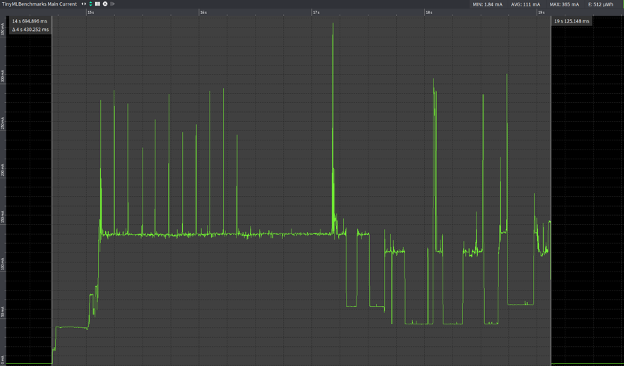

# Stroomverbuik

Bovenstaande berekeningen zijn gemaakt voor de esp32-c3. Het verbruik van de wifi is gebaseerd op dit van de standaard esp32, doordat er geen data beschikbaar was online over het verbruik van de esp32-c3. Indien we de datasheets van beide vergelijken over het energieverbruik zien we dat de piekstroom bij de esp32-c3 ongeveer het gemiddelde is van de standaard esp32. Doordat er geen gemiddeldes opgegeven zijn bij de esp32-c3 is er niet echt een numerieke vergelijking mogelijk, enkel dat we er vanuit kunnen gaan dat het verbruik van de esp32-c3 lager zal liggen.

Bovenstaande grafiek geeft weer hoeveel elk deel verbruikt. Wat direct opvalt is dat de voeding al 19.6% verbruikt enkel aan aardlus, lekstroom. Dit is eigenlijk te veel. In de toekomst zou deze best vervangen worden door een veel efficiëntere. De fout die gemaakt werd bij de keuze van deze component is dat we gezocht hadden naar een component met een lage drop-out spanning en lage "Quiescent Current". We hadden gebruikt gemaakt van Mouser voor het zoeken naar een geschikte component maar de "Quiescent Current" waar naar verwezen werd blijkt enkel te kloppen indien de "Shutdown" pin geïnverteerd wordt en de voeding dus uitstaat. Aangezien het in onze toepassing niet de bedoeling is om de voeding uitschakelen is deze eigenschap niet nuttig.

Het verbuik van de gekozen communicatie methode, met name mqtt valt goed mee 28.1%. Indien we deze verder toch nog zouden willen verlagen, zouden we ervoor kunnen kiezen om meer data te accumuleren en bijvoorbeeld maar om de 2 uur door te sturen hierdoor zou het stroomverbruik bijna halveren. Zoals eerder gezegd zou ook de esp32-c3 nog het stroomverbruik doen dalen.

Het stroomverbruik van de BM680 en de esp32 verbuiken samen 50.8% de reden waarom we deze samen moeten bekijken is omdat het de BME680 sensor verantwoordelijk is voor het hoge verbruik van de esp32 doordat deze elke 5 min een meting moet doen. Software matig is er niets verder te optimaliseren om dit verbruikt te doen dalen.

We hebben tijdens de labosessies ook metingen gedaan rond het stroomverbruik, dit was met de devkit van een standaard esp32 en de devkit van de BME680. We hebben van beide bordjes de leds verwijderd en bekwamen volgende meetresultaten. Op de eerste grafiek is het stroomverbruikt te zien tijden het versturen van de data. Dit komt vrij goed overeen met de geschatte waardes in onze berekeningen. In de 2de grafiek is het verbruik te zien tijdens een meting. Het vergelijken met de berekeningen is hier niet eenvoudig, doordat er bij de berekeningen gebruik gemaakt is van een gemiddelde waarde. Wat wel te zien is op beide grafieken is het verbuik in slaap, deze is 1.8mA, wat veel groter is dan in de berekeningen waar dit ongeveer 130µA is. Hoe dit komt hebben we niet kunnen onderzoeken, waarschijnlijk is er een pullup weerstand aanwezig op een van de devkits die hiervoor zorgt.

Indien we dit nu zouden willen voeden met AA batterijen zouden we er ongeveer 6 nodig hebben per jaar aangezien een AA baterij een gemiddelde capaciteit van 2-3 Wh heeft.
