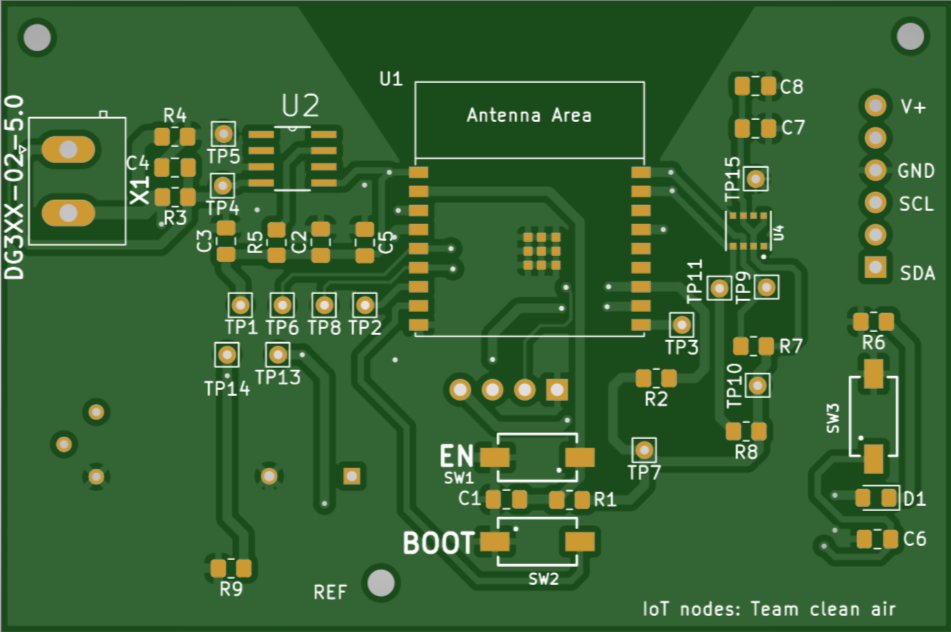
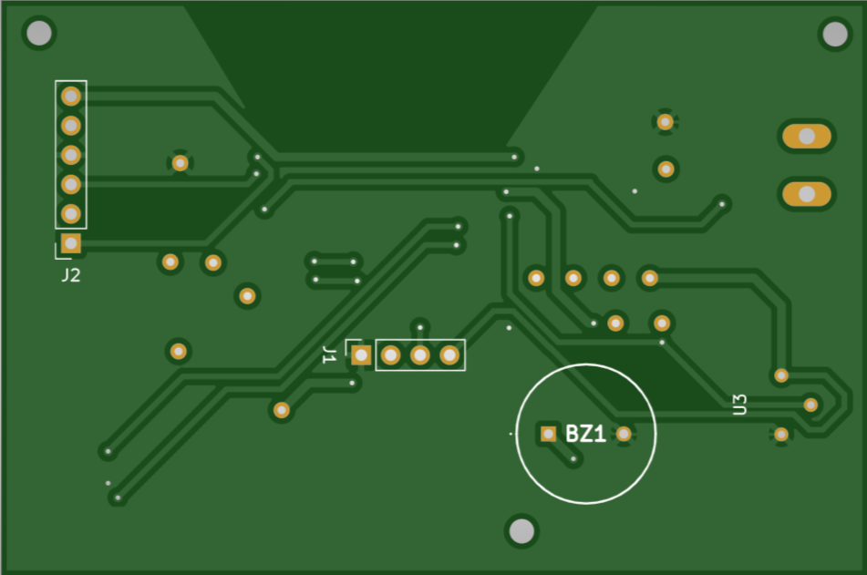

## PCB 
Hieronder zijn de top en bottom views te zien van onze PCB. Centraal bevindt zich de esp32, rechts bevindt zich de BME680 (U4) en links bevindt zich de PIR sensor. De twee sensoren staan zo ver als mogelijk uit elkaar omdat de PIR sensor gevoelig is voor warmte en de BME680 redelijk wat warmte genereert. Naast deze zaken zijn ook enkele basis voorzieningen aanwezig zoals vele testpunten, een LDO, een test LED en knop en extra pinheaders om een BME680 module te kunnen bevestigen (dit is voor in het geval dat we er niet in slagen om de BME680 aan onze PCB te solderen). 

Bij het testen van het pcb zijn er enkele fouten in het design ontdekt. Bij de LM2989 was de enable niet verbonden met de Vin en de sense pin niet met de Vout. Er is ook voor gekozen om een pull-up weerstand toe te voegen aan de testbutton omdat we de interne weerstand niet onmiddellijk software matig konden ingesteld krijgen. Er waren ook nog 2 pinnen die op de esp hoog moesten zijn tijdens het downloaden van de code. Deze problemen konden opgelost worden door de aanwezige testpunten.

Bij het testen van de BME680 werkte deze niet, we hebben deze herhaaldelijk er terug af gesoldeerd en terug opgezet maar deze module wou maar niet werken. Gelukkig waren we hier op voorbereid en hadden we headers voorzien waarop we het testboard konden plaatsen.

